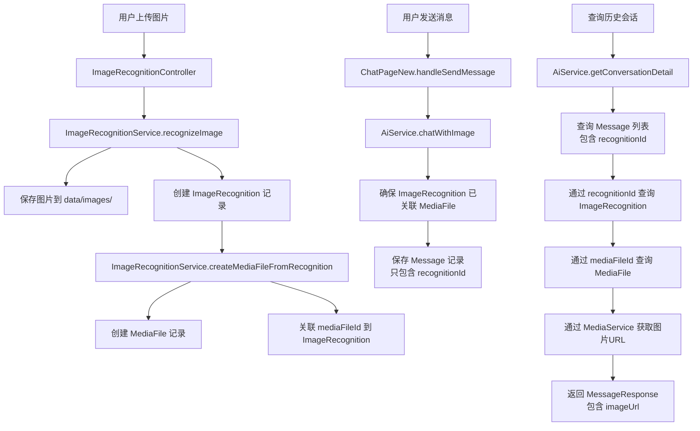

# 图片上传展示补充设计文档

## 架构设计概览

### 实体关联关系图

```
┌─────────────────┐
│    Message      │
│  (消息实体)     │
│                 │
│ - id            │
│ - content       │
│ - recognitionId │────┐
└─────────────────┘   │
                        │
                        │ 通过 recognitionId 关联
                        │
                        ▼
              ┌─────────────────────┐
              │ ImageRecognition    │
              │ (图片识别记录)       │
              │                     │
              │ - recognitionId     │
              │ - description       │
              │ - imagePath         │
              │ - mediaFileId       │────┐
              └─────────────────────┘   │
                                        │
                                        │ 通过 mediaFileId 关联
                                        │
                                        ▼
                              ┌─────────────────┐
                              │   MediaFile     │
                              │  (媒体文件)      │
                              │                 │
                              │ - fileId        │
                              │ - filePath      │
                              │ - seafilePath   │
                              │ - accessMethod  │
                              │ - isViewable    │
                              └─────────────────┘
```

### 数据流转图



### 核心设计原则

1. **层次化关联**：
   - `Message` 只关联 `ImageRecognition`（通过 `recognitionId`）
   - `ImageRecognition` 关联 `MediaFile`（通过 `mediaFileId`）
   - 形成清晰的关联链：`Message` → `ImageRecognition` → `MediaFile`

2. **职责分离**：
   - `Message`：负责消息内容和识别记录的关联
   - `ImageRecognition`：负责图片识别信息和媒体文件的关联
   - `MediaFile`：负责统一管理图片访问（支持 LOCAL、SEAFILE、OSS）

3. **统一访问**：
   - 所有图片访问都通过 `MediaFile` 统一管理
   - 不直接存储 URL，避免 URL 变化导致的问题
   - 支持多种存储方式，易于扩展

---

## 一、问题描述

### 1.1 当前问题

用户上传的图片虽然能保存到后端，但在对话中无法显示，且查看历史会话时也无法看到图片。主要问题包括：

1. **消息实体缺少图片字段**：`Message` 实体只有 `content` 字段，没有存储图片信息
2. **消息保存时未关联图片**：保存用户消息时，只保存了文本内容，没有保存图片URL或图片ID
3. **历史会话查询缺少图片信息**：查询历史会话时，返回的消息中没有图片信息
4. **未创建媒体文件记录**：上传的图片没有创建 `MediaFile` 记录，无法统一管理
5. **前端显示依赖缺失**：前端需要图片URL来显示图片，但后端没有提供

### 1.2 期望效果

- ✅ 用户上传图片后，图片能在当前对话中立即显示
- ✅ 查看历史会话时，能够看到之前上传的图片
- ✅ 上传的图片能够创建 `MediaFile` 记录，便于统一管理
- ✅ 图片能够通过统一的媒体文件访问接口获取

---

## 二、需要修改的部分

### 2.1 数据库层修改

#### 2.1.1 Message 实体类扩展

**文件路径**：`src/backend/cleaner-support-agent-backend/src/main/java/org/backend/cleanersupportagentbackend/entity/Message.java`

**需要添加的字段**：

```java
/**
 * 关联的图片识别记录ID（用于关联 ImageRecognition）
 * 通过 ImageRecognition 可以获取图片识别信息和关联的 MediaFile
 */
@Column(length = 50)
private String recognitionId;
```

**修改说明**：
- `recognitionId`：关联到 `ImageRecognition` 表。通过 `ImageRecognition` 可以获取图片识别信息，并通过 `ImageRecognition.mediaFileId` 进一步获取 `MediaFile`，从而统一管理图片访问。
- **关联链**：`Message` -> `ImageRecognition` -> `MediaFile`，层次清晰，职责分明

#### 2.1.2 数据库迁移脚本

**文件路径**：`src/backend/cleaner-support-agent-backend/src/main/resources/db/migration_add_message_image_fields.sql`

**需要执行的SQL**：

```sql
-- 为 messages 表添加图片相关字段
ALTER TABLE messages 
ADD COLUMN recognition_id VARCHAR(50) COMMENT '关联的图片识别记录ID';

-- 添加索引以优化查询
CREATE INDEX idx_messages_recognition_id ON messages(recognition_id);
```

**同时需要修改 ImageRecognition 表**：

```sql
-- 为 image_recognitions 表添加媒体文件ID字段
ALTER TABLE image_recognitions 
ADD COLUMN media_file_id VARCHAR(50) COMMENT '关联的媒体文件ID（统一管理图片访问）';

-- 添加索引以优化查询
CREATE INDEX idx_image_recognitions_media_file_id ON image_recognitions(media_file_id);
```

---

### 2.2 实体类修改

#### 2.2.1 ImageRecognition 实体类扩展

**文件路径**：`src/backend/cleaner-support-agent-backend/src/main/java/org/backend/cleanersupportagentbackend/entity/ImageRecognition.java`

**需要添加的字段**：

```java
/**
 * 关联的媒体文件ID（用于关联 MediaFile，统一管理图片访问）
 * 通过 MediaFile 可以获取图片的访问信息，无论图片存储在本地、Seafile 还是 OSS
 */
@Column(length = 50)
private String mediaFileId;
```

**修改说明**：
- `mediaFileId`：关联到 `MediaFile` 表，统一管理图片访问。`ImageRecognition` 不再直接存储 `imageUrl`，而是通过 `MediaFile` 获取。
- `imageUrl` 字段可以保留用于向后兼容，但主要使用 `mediaFileId` 来获取图片访问信息。

---

### 2.3 业务逻辑层修改

#### 2.3.1 ImageRecognitionService 扩展

**文件路径**：`src/backend/cleaner-support-agent-backend/src/main/java/org/backend/cleanersupportagentbackend/service/ImageRecognitionService.java`

**需要添加的方法**：

```java
/**
 * 为上传的图片创建 MediaFile 记录，并关联到 ImageRecognition
 * @param recognition 图片识别记录
 * @return 创建的 MediaFile 对象
 */
@Transactional
public MediaFile createMediaFileFromRecognition(ImageRecognition recognition) {
    // 如果已经有关联的 MediaFile，直接返回
    if (recognition.getMediaFileId() != null) {
        return mediaFileRepository.findByFileId(recognition.getMediaFileId())
            .orElseThrow(() -> new RuntimeException("关联的 MediaFile 不存在"));
    }
    
    // 生成文件ID
    String fileId = IdGenerator.generateMediaFileId();
    
    // 从文件路径提取文件名
    String filename = Paths.get(recognition.getImagePath()).getFileName().toString();
    
    // 构建标题（使用识别描述的前50个字符，如果没有则使用文件名）
    String title = recognition.getDescription() != null 
        ? recognition.getDescription().substring(0, Math.min(50, recognition.getDescription().length()))
        : filename;
    
    // 判断文件类型
    String ext = filename.toLowerCase().substring(filename.lastIndexOf('.') + 1);
    MediaFile.FileType fileType = MediaFile.FileType.Image;
    
    // 判断是否可预览（图片都可以预览）
    Boolean isViewable = true;
    
    // 创建 MediaFile 记录
    MediaFile mediaFile = MediaFile.builder()
        .fileId(fileId)
        .title(title)
        .type(fileType)
        .category("user_upload") // 用户上传的图片
        .seafilePath(null) // 本地文件，不使用 Seafile
        .filePath(recognition.getImagePath()) // 使用本地文件路径
        .accessMethod(MediaFile.AccessMethod.LOCAL) // 本地访问方式
        .isViewable(isViewable)
        .build();
    
    mediaFile = mediaFileRepository.save(mediaFile);
    
    // 关联 MediaFile 到 ImageRecognition
    recognition.setMediaFileId(mediaFile.getFileId());
    imageRecognitionRepository.save(recognition);
    
    return mediaFile;
}
```

#### 2.3.2 AiService 修改

**文件路径**：`src/backend/cleaner-support-agent-backend/src/main/java/org/backend/cleanersupportagentbackend/service/AiService.java`

**需要修改的方法**：

1. **`chatWithImage` 方法**：保存用户消息时，同时保存图片信息

```java
// 确保 ImageRecognition 已关联 MediaFile
imageRecognitionService.createMediaFileFromRecognition(recognition);

// 在保存用户消息时，添加图片信息（只关联 recognitionId）
Message userMessage = Message.builder()
    .conversation(conversation)
    .role(Message.MessageRole.user)
    .content(fullQuery)
    .recognitionId(recognition.getRecognitionId()) // 关联图片识别记录
    .timestamp(LocalDateTime.now())
    .build();
messageRepository.save(userMessage);
```

2. **`getConversationDetail` 方法**：返回消息时，包含图片信息

```java
// 在构建 MessageResponse 时，添加图片信息
// 通过 Message -> ImageRecognition -> MediaFile 关联链获取图片信息
String imageUrl = null;
String mediaFileId = null;
if (message.getRecognitionId() != null) {
    try {
        // 获取 ImageRecognition
        ImageRecognition recognition = imageRecognitionRepository
            .findByRecognitionId(message.getRecognitionId())
            .orElse(null);
        
        if (recognition != null && recognition.getMediaFileId() != null) {
            mediaFileId = recognition.getMediaFileId();
            // 通过 MediaService 获取图片预览URL
            imageUrl = mediaService.getFilePreviewUrl(mediaFileId);
        }
    } catch (Exception e) {
        // 如果获取失败，imageUrl 保持为 null
        log.warn("获取媒体文件预览URL失败: recognitionId={}", message.getRecognitionId(), e);
    }
}

MessageResponse messageResponse = MessageResponse.builder()
    .id(message.getId().toString())
    .role(message.getRole().name())
    .content(message.getContent())
    .recognitionId(message.getRecognitionId()) // 添加识别ID
    .mediaFileId(mediaFileId) // 添加媒体文件ID（通过 ImageRecognition 获取）
    .imageUrl(imageUrl) // 添加图片URL（通过 MediaFile 获取）
    .timestamp(message.getTimestamp())
    .build();
```

---

### 2.4 DTO 层修改

#### 2.4.1 MessageResponse 扩展

**文件路径**：`src/backend/cleaner-support-agent-backend/src/main/java/org/backend/cleanersupportagentbackend/dto/MessageResponse.java`

**需要添加的字段**：

```java
/**
 * 关联的图片识别记录ID（当消息包含图片时）
 * 前端可以通过此ID查询图片识别信息
 */
private String recognitionId;

/**
 * 关联的媒体文件ID（可选，由后端通过 ImageRecognition 获取后返回）
 * 前端可以通过此ID调用媒体文件访问接口获取图片URL
 */
private String mediaFileId;

/**
 * 图片URL（可选，由后端通过 MediaFile 获取后返回，便于前端直接显示）
 * 如果为 null，前端需要通过 mediaFileId 调用接口获取
 */
private String imageUrl;
```

---

### 2.5 控制器层修改

#### 2.5.1 ImageRecognitionController 修改

**文件路径**：`src/backend/cleaner-support-agent-backend/src/main/java/org/backend/cleanersupportagentbackend/controller/app/ImageRecognitionController.java`

**需要修改的逻辑**：

在 `uploadAndRecognize` 方法中，上传图片后自动创建 `MediaFile` 记录：

```java
@PostMapping
public ResponseEntity<ApiResponse<ImageRecognitionResponse>> uploadAndRecognize(
        @CurrentUserId String userId,
        @RequestParam("image") MultipartFile image) {
    try {
        // 识别图片
        ImageRecognitionResponse response = imageRecognitionService.recognizeImage(userId, image);
        
        // 获取识别记录
        ImageRecognition recognition = imageRecognitionService.getRecognitionById(response.getRecognitionId());
        
        // 创建 MediaFile 记录
        MediaFile mediaFile = imageRecognitionService.createMediaFileFromRecognition(recognition);
        
        // 在响应中添加 mediaFileId（可选）
        // response.setMediaFileId(mediaFile.getFileId());
        
        return ResponseEntity.ok(ApiResponse.success(response));
    } catch (Exception e) {
        return ResponseEntity.ok(ApiResponse.error(500, e.getMessage()));
    }
}
```

---

### 2.6 前端修改

#### 2.6.1 API 接口类型定义

**文件路径**：`src/frontend/src/services/api/index.ts` 或相关类型定义文件

**需要修改的接口**：

```typescript
// Message 接口添加图片字段
export interface Message {
  id: string;
  role: 'user' | 'assistant';
  content: string;
  recognitionId?: string; // 添加识别ID字段（主要字段，用于关联 ImageRecognition）
  mediaFileId?: string; // 添加媒体文件ID字段（可选，后端可能直接返回）
  imageUrl?: string; // 添加图片URL字段（可选，后端可能直接返回）
  timestamp: string;
}
```

#### 2.6.2 ChatPageNew 组件修改

**文件路径**：`src/frontend/src/components/ChatPageNew.tsx`

**需要修改的部分**：

1. **发送消息时保存图片信息**：

```typescript
// 在 handleSendMessage 中，如果有上传的图片，需要保存图片信息
const handleSendMessage = async (text: string, imageId?: string) => {
  // ... 现有逻辑 ...
  
  // 如果有图片，获取图片信息
  let mediaFileId: string | undefined;
  let imageUrl: string | undefined;
  if (imageId) {
    const uploadedImage = uploadedImages.find(img => img.id === imageId);
    if (uploadedImage && uploadedImage.status === 'completed') {
      // 优先使用 mediaFileId（如果后端返回了）
      mediaFileId = uploadedImage.mediaFileId;
      // 如果没有 mediaFileId，使用 imageUrl 作为后备
      imageUrl = uploadedImage.imageUrl;
    }
  }
  
  // 在构建消息时，添加图片信息
  const userMessage: Message = {
    id: Date.now().toString(),
    type: 'user',
    content: text,
    image: imageUrl, // 临时显示用，实际应该通过 mediaFileId 获取
    timestamp: new Date(),
  };
  
  // ... 发送消息逻辑（后端会保存 mediaFileId） ...
};
```

2. **历史会话加载时显示图片**：

```typescript
// 在加载历史会话时，确保图片信息被正确加载
const loadConversationDetail = async (conversationId: string) => {
  const detail = await getConversationDetail(conversationId);
  
  // 转换消息格式，确保包含图片信息
  const messages: Message[] = detail.messages.map(msg => ({
    id: msg.id,
    type: msg.role === 'user' ? 'user' : 'ai',
    content: msg.content,
    image: msg.imageUrl, // 使用后端返回的 imageUrl（后端已通过 MediaFile 获取）
    // 如果后端没有返回 imageUrl，前端可以通过 msg.mediaFileId 调用媒体文件接口获取
    timestamp: new Date(msg.timestamp),
  }));
  
  setMessages(messages);
};
```

3. **消息显示组件**（已有逻辑，确保正确使用）：

```typescript
// 在消息显示部分，确保图片能正确显示
// 优先使用 message.image（后端返回的 imageUrl）
// 如果没有，可以通过 message.mediaFileId 调用媒体文件接口获取
{message.image && (
   {
      console.error('[ChatPage] 图片加载失败:', message.image);
      // 如果 imageUrl 加载失败，可以尝试通过 mediaFileId 获取
      // 或者显示占位符
      e.currentTarget.style.display = 'none';
    }}
  />
)}
```

---

### 2.7 媒体文件访问接口

#### 2.7.1 MediaController 扩展

**文件路径**：`src/backend/cleaner-support-agent-backend/src/main/java/org/backend/cleanersupportagentbackend/controller/app/MediaController.java`

**需要确保的接口**：

确保 `/api/cleaner-support/v2/media/images/{filename}` 接口能够正确返回图片文件。该接口应该已经存在，用于返回 `data/images/` 目录下的图片。

---

## 三、实现步骤

### 3.1 第一阶段：数据库和实体类修改

1. ✅ 创建数据库迁移脚本，为 `messages` 表添加 `recognition_id` 字段
2. ✅ 创建数据库迁移脚本，为 `image_recognitions` 表添加 `media_file_id` 字段
3. ✅ 修改 `Message` 实体类，添加 `recognitionId` 字段
4. ✅ 修改 `ImageRecognition` 实体类，添加 `mediaFileId` 字段
5. ✅ 修改 `MessageResponse` DTO，添加图片相关字段

### 3.2 第二阶段：业务逻辑修改

1. ✅ 在 `ImageRecognitionService` 中添加 `createMediaFileFromRecognition` 方法，创建 MediaFile 并关联到 ImageRecognition
2. ✅ 修改 `ImageRecognitionController`，上传图片后自动创建 `MediaFile` 记录并关联
3. ✅ 修改 `AiService.chatWithImage`，保存消息时只关联 `recognitionId`
4. ✅ 修改 `AiService.getConversationDetail`，通过 `recognitionId` -> `mediaFileId` 获取图片信息

### 3.3 第三阶段：前端修改

1. ✅ 更新前端 `Message` 接口类型定义
2. ✅ 修改 `ChatPageNew` 组件，发送消息时保存图片信息
3. ✅ 修改历史会话加载逻辑，确保图片信息被正确加载
4. ✅ 测试图片显示功能

### 3.4 第四阶段：测试和优化

1. ✅ 测试图片上传和显示功能
2. ✅ 测试历史会话中的图片显示
3. ✅ 测试图片访问权限
4. ✅ 优化图片加载性能

---

## 四、数据流程

### 4.1 图片上传流程

```
用户上传图片
  ↓
ImageRecognitionController.uploadAndRecognize
  ↓
ImageRecognitionService.recognizeImage
  ↓
保存图片到 data/images/
  ↓
创建 ImageRecognition 记录
  ↓
ImageRecognitionService.createMediaFileFromRecognition
  ↓
创建 MediaFile 记录（关联本地文件路径）
  ↓
返回 ImageRecognitionResponse（包含 imageUrl）
```

### 4.2 发送带图片的消息流程

```
用户发送消息（包含图片）
  ↓
ChatPageNew.handleSendMessage
  ↓
获取图片信息（recognitionId）
  ↓
调用 AiService.chatWithImage
  ↓
确保 ImageRecognition 已关联 MediaFile
  ↓
保存用户消息（只包含 recognitionId）
  ↓
调用 Dify API 进行对话
  ↓
保存 AI 回复消息
  ↓
前端显示消息（通过 recognitionId -> mediaFileId 获取图片URL）
```

### 4.3 历史会话加载流程

```
用户查看历史会话
  ↓
调用 getConversationDetail API
  ↓
AiService.getConversationDetail
  ↓
查询消息列表（包含 recognitionId 字段）
  ↓
通过 recognitionId 查询 ImageRecognition
  ↓
通过 ImageRecognition.mediaFileId 获取 MediaFile
  ↓
通过 MediaService 获取每个消息的图片URL
  ↓
构建 MessageResponse（包含 recognitionId、mediaFileId 和 imageUrl）
  ↓
前端接收消息列表
  ↓
渲染消息（显示图片，优先使用 imageUrl，如果没有则通过 mediaFileId 获取）
```

---

## 五、注意事项

### 5.1 数据一致性

- 确保 `Message.recognitionId` 对应的 `ImageRecognition` 记录存在
- 确保 `ImageRecognition.mediaFileId` 对应的 `MediaFile` 记录存在
- 删除图片时，需要考虑是否删除关联的 `ImageRecognition` 和 `MediaFile` 记录
- `ImageRecognition.imageUrl` 可以保留用于向后兼容，但主要使用 `mediaFileId` 来获取图片访问信息

### 5.2 性能优化

- 图片URL使用相对路径，减少数据传输
- 前端使用懒加载，只在需要时加载图片
- 考虑使用CDN或对象存储来存储图片

### 5.3 安全性

- 确保图片访问接口有权限验证
- 验证用户只能访问自己上传的图片
- 防止路径遍历攻击

### 5.4 向后兼容

- 历史消息可能没有 `recognitionId` 字段，前端需要兼容处理
- 历史的 `ImageRecognition` 记录可能没有 `mediaFileId` 字段，需要兼容处理
- 数据库迁移时，现有记录的图片字段为 NULL，这是正常的
- 如果消息有 `recognitionId` 但 `ImageRecognition` 没有 `mediaFileId`，可以通过 `ImageRecognition.imageUrl` 作为后备

---

## 六、测试要点

### 6.1 功能测试

1. ✅ 上传图片后，图片能在当前对话中显示
2. ✅ 发送带图片的消息后，消息和图片都能正确保存
3. ✅ 查看历史会话时，能够看到之前上传的图片
4. ✅ 图片URL能够正确访问

### 6.2 边界测试

1. ✅ 上传多张图片后，每张图片都能正确显示
2. ✅ 图片上传失败时，消息仍能正常发送（不带图片）
3. ✅ 历史会话中没有图片的消息，不会显示图片占位符

### 6.3 性能测试

1. ✅ 大量历史消息加载时，图片加载不影响页面性能
2. ✅ 图片访问接口响应时间合理

---

## 七、相关文件清单

### 7.1 后端文件

- `src/backend/cleaner-support-agent-backend/src/main/java/org/backend/cleanersupportagentbackend/entity/Message.java`
- `src/backend/cleaner-support-agent-backend/src/main/java/org/backend/cleanersupportagentbackend/entity/ImageRecognition.java`
- `src/backend/cleaner-support-agent-backend/src/main/java/org/backend/cleanersupportagentbackend/dto/MessageResponse.java`
- `src/backend/cleaner-support-agent-backend/src/main/java/org/backend/cleanersupportagentbackend/service/ImageRecognitionService.java`
- `src/backend/cleaner-support-agent-backend/src/main/java/org/backend/cleanersupportagentbackend/service/AiService.java`
- `src/backend/cleaner-support-agent-backend/src/main/java/org/backend/cleanersupportagentbackend/controller/app/ImageRecognitionController.java`
- `src/backend/cleaner-support-agent-backend/src/main/resources/db/migration_add_message_image_fields.sql`

### 7.2 前端文件

- `src/frontend/src/components/ChatPageNew.tsx`
- `src/frontend/src/services/api/index.ts`（或相关类型定义文件）

---

## 八、总结

本设计文档说明了如何实现图片在对话中的显示功能，主要包括：

1. **数据库扩展**：
   - 为 `Message` 表添加 `recognitionId` 字段，关联图片识别记录
   - 为 `ImageRecognition` 表添加 `mediaFileId` 字段，关联媒体文件
2. **实体类修改**：
   - 扩展 `Message` 实体，添加 `recognitionId` 字段
   - 扩展 `ImageRecognition` 实体，添加 `mediaFileId` 字段
   - 扩展 `MessageResponse` DTO，添加图片相关字段
3. **业务逻辑完善**：
   - 在保存消息时只关联 `recognitionId`
   - 在查询时通过 `Message` -> `ImageRecognition` -> `MediaFile` 关联链获取图片信息
4. **媒体文件管理**：为上传的图片创建 `MediaFile` 记录并关联到 `ImageRecognition`，支持不同存储方式（LOCAL、SEAFILE、OSS）
5. **前端适配**：前端优先使用后端返回的 `imageUrl`，如果没有则通过 `mediaFileId` 调用媒体文件接口获取

**设计优势**：
- ✅ **层次清晰**：`Message` -> `ImageRecognition` -> `MediaFile` 关联链，职责分明
- ✅ **统一管理**：所有图片访问都通过 `MediaFile` 统一管理，无论存储方式如何
- ✅ **灵活扩展**：支持本地存储、Seafile、OSS 等多种存储方式
- ✅ **稳定可靠**：`ImageRecognition` 不再直接存储URL，而是通过 `MediaFile` 获取，避免URL变化导致的问题
- ✅ **易于维护**：图片访问逻辑集中在 `MediaService` 中，识别信息集中在 `ImageRecognition` 中

**关联关系**：
```
Message (消息)
  └─ recognitionId → ImageRecognition (图片识别记录)
                      └─ mediaFileId → MediaFile (媒体文件)
                                        └─ 统一管理图片访问
```

通过以上修改，用户上传的图片将能够在对话中显示，并且在查看历史会话时也能看到之前上传的图片。
